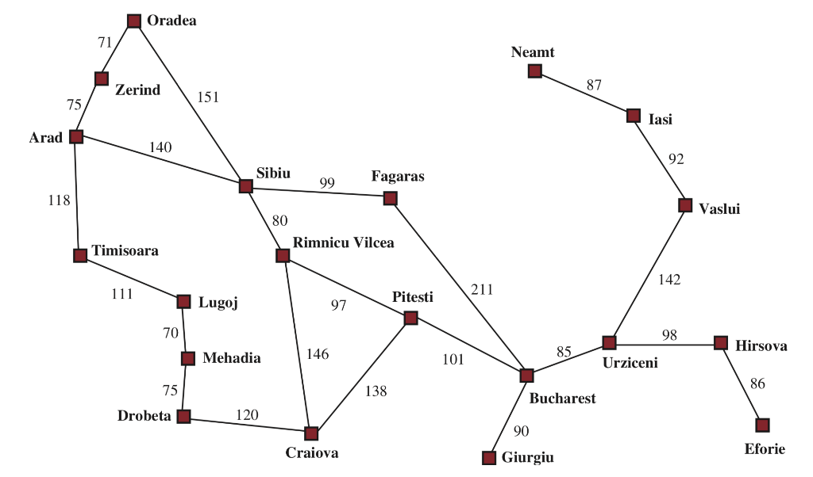

# Depth-First Search (DFS) for Romania Roadmap

## Define DFS

Depth-First Search (DFS) is an algorithm used for traversing or searching tree or graph data structures. It explores as far down a branch as possible before backtracking. DFS can be implemented using a stack (iteratively) or recursion.

## Problem Definition: Romania Roadmap

The problem involves finding a path from a starting city to a destination city in Romania using a given roadmap represented as a graph.

## Algorithm Steps

### Initialization:
- Initialize a stack (`stack`) with the start node.
- Initialize a visited dictionary (`visited`) to keep track of visited nodes.
- Initialize a `came_from` dictionary to track the path from each node back to its predecessor.

### DFS Traversal:
- While the stack is not empty:
  - Pop the top node (`current`) from the stack.
  - If `current` is the goal node, backtrack using `came_from` to reconstruct the path and return it.
  - Otherwise, iterate through each neighbor of `current`:
    - If a neighbor hasn't been visited, mark it as visited, set its predecessor, and push it onto the stack.

### Path Reconstruction:
- If the goal node is found, reconstruct the path from start to goal using the `came_from` dictionary.

## Code Structure

### Graph Representation:
The roadmap (graph) is represented as a dictionary where keys are cities (nodes) and values are sets of neighboring cities (connected nodes).

### `dfs_search` Function:

#### Input Parameters:
- `graph`: The graph represented as an adjacency list.
- `start`: The starting city.
- `goal`: The destination city.

#### Output:
Returns a path (list of cities) from `start` to `goal` if one exists, otherwise returns `None`.

## How to Run the Code

### Prerequisites:
Ensure you have Python installed on your computer. If not, download and install Python from the official website.

### Steps to Run the Code:
1. **Download the Code**:
   Download the Python script containing the `dfs_search` function and the graph representation (roadmap). Save it to your computer.
   
2. **Open a Text Editor**:
   Use any text editor (e.g., Notepad, VS Code, Sublime Text) to open the downloaded Python script.
   
3. **Edit Start and Goal Cities**:
   Locate the part of the script where the start and goal cities are defined.
   Modify the `start` and `goal` variables to specify your desired starting and destination cities within the Romania roadmap.
   
4. **Run the Script**:
   Execute the Python script.

## Conclusion

This implementation of DFS provides a method to navigate the Romania roadmap (graph) to find routes between cities. DFS is effective for this problem but may not always find the shortest path. The provided code demonstrates how to apply DFS to solve this type of pathfinding problem in a graph-based context.
